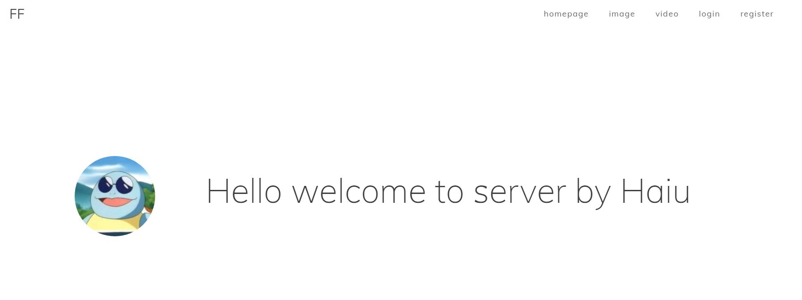

### **Lightweight webserver in Linux**
* Concurrency model using thread pool + non-blocking socket + epoll (implemented by ET and LT) + event processing (implemented by Reactor and simulated Proactor)
* Use state machine to parse HTTP request messages, support parsing GET and POST requests
* Access the server database to realize web-side user registration and login functions, and can request server pictures and video files
* Implement synchronous/asynchronous log system to record server running status
* After the Webbench stress test, tens of thousands of concurrent connection data exchange can be achieved

### **Quick Start**
Requirements:
* Ubuntu 16.04+
* MySQL 5.7.29+
* gcc 4.8+

```
cd build
cmake ..
make
./server
// in browser
ip:1316
```

### **Structure and Demo**
* structure:

* homepage:


* login: 


### **TO DO** 
* Camera
* Config
* Unit Test
* Circular buffer

### **References** 

[CGI Programming for C Programmers](https://www.openroad.org/cgihelp/cgi.html)\
[Scalable I/O: Events- Vs Multithreading-based](https://thetechsolo.wordpress.com/2016/02/29/scalable-io-events-vs-multithreading-based/)\
[Blocking I/O, Nonblocking I/O, And Epoll](https://eklitzke.org/blocking-io-nonblocking-io-and-epoll)\
[Beej’s Guide to Network Programming](https://beej.us/guide/bgnet/)\
[Linux High-performance server programming](https://book.douban.com/subject/24722611/)\
[Advanced Programming in the UNIX Environment](chrome-extension://efaidnbmnnnibpcajpcglclefindmkaj/https://xesoa.com/wp-content/uploads/2014/04/APUE-3rd.pdf)
